# 🐧 Linux – Real-Time DevOps Automation Project

This project demonstrates a complete **Linux server automation workflow** used in real DevOps environments. It includes user management, automation, monitoring, security hardening, LVM, and custom system services.

---

# 📘 **Level 1 – Basic (Foundational Skills)**

### **Objective:** Prepare the Linux environment for application deployment.

---

## ✔ **User & Group Management**

### **Commands**

```bash
# Create group
sudo groupadd devteam

# Create users and add them to group
sudo useradd -m -G devteam devuser1
sudo useradd -m -G devteam devuser2

# Set passwords
sudo passwd devuser1
sudo passwd devuser2

```
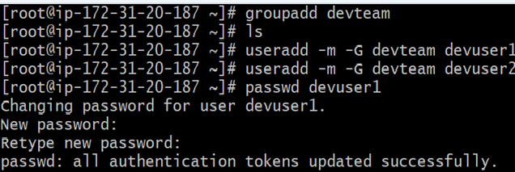
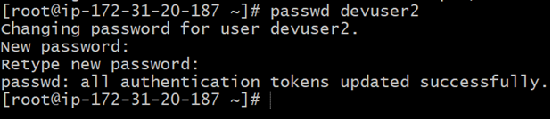
---

## ✔ **Permission Management**

### **Commands**

```bash
# Create project directory
sudo mkdir -p /opt/myproject

# Change ownership to devteam
sudo chown -R :devteam /opt/myproject

# Give group write access
sudo chmod -R 775 /opt/myproject

# Verify permissions
ls -l /opt
```
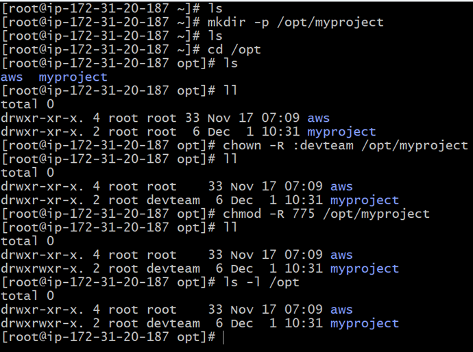
---

## ✔ **Package Installation**

### **Commands**

```bash
# Update repository
sudo apt update   # Ubuntu/Debian
sudo yum update   # RHEL/CentOS/AmazonLinux

# Install Git
sudo apt install git -y
sudo yum install git -y

# Install Nginx
sudo apt install nginx -y
sudo yum install nginx -y

# Install Java
sudo apt install openjdk-11-jdk -y
sudo yum install java-11-openjdk -y
```
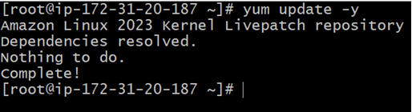
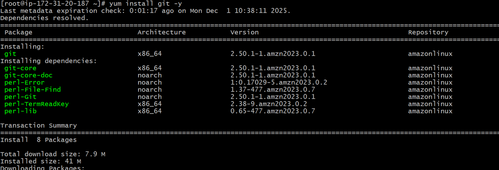
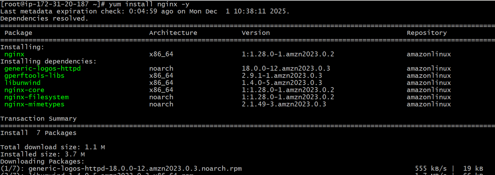
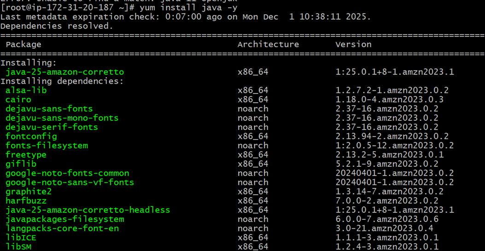


---

## ✔ **System Information Checks**

### **Commands**

```bash
# CPU info
lscpu

# Memory info
free -h

# Disk usage
df -h

# Running processes
top
ps aux
```
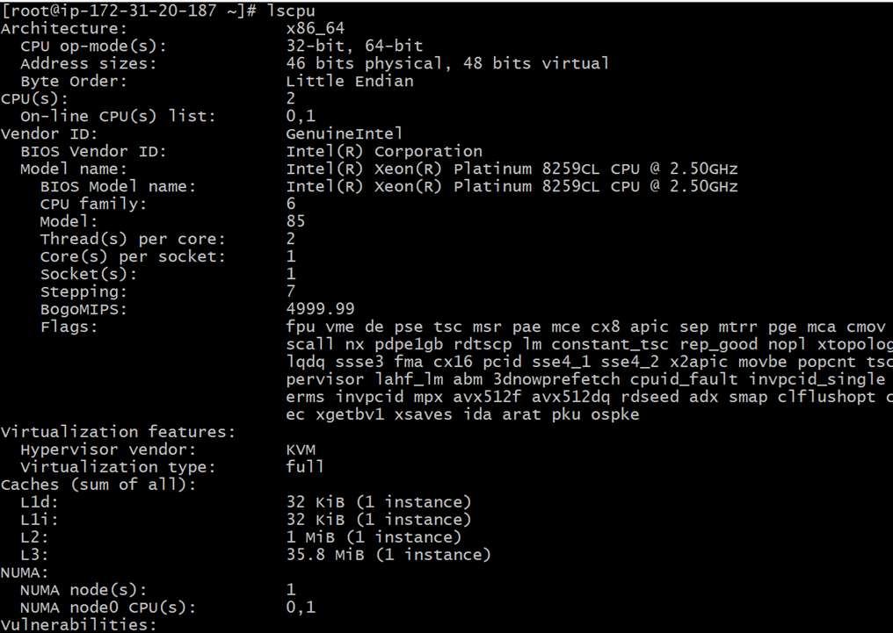
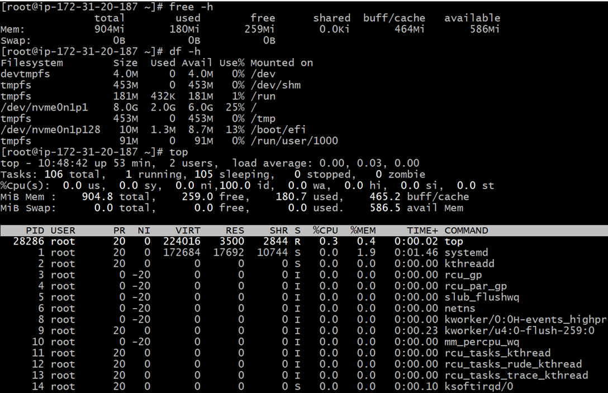
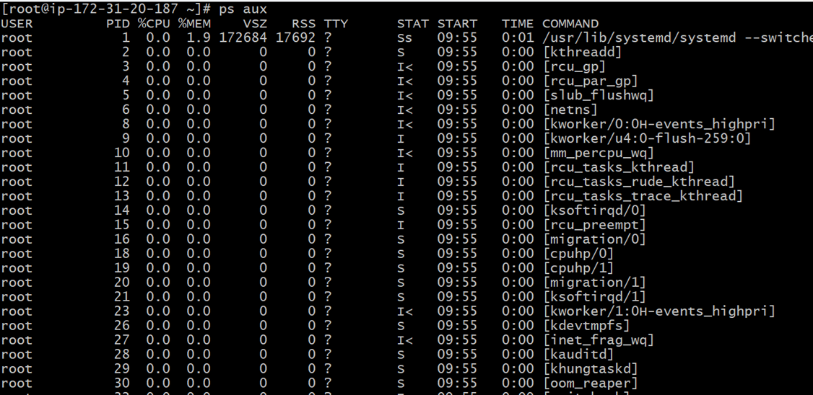


---

# 📙 **Level 2 – Intermediate (Daily DevOps Tasks)**

### **Objective:** Automate and maintain server health.

---

## ✔ **Automated Backup with Cron**

### **Commands**

```bash
# Edit cron job
crontab -e

# Example backup job (runs daily at 1AM)
0 1 * * * tar -czf /opt/backup/project-$(date +\%F).tar.gz /opt/myproject
```
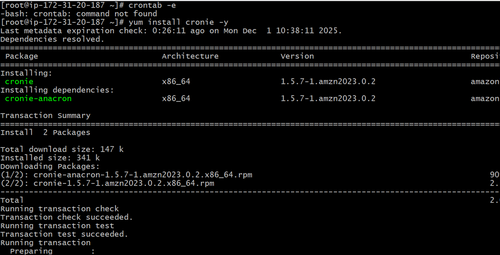
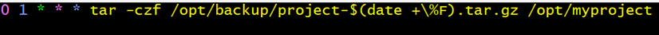

---

## ✔ **Shell Scripting (Automation)**

### **Log cleanup script**

```bash
vi /usr/local/bin/log_cleanup.sh
```

```bash
#!/bin/bash
find /var/log/myapp -type f -mtime +7 -delete
```
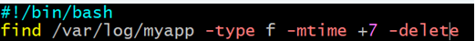
```bash
chmod +x /usr/local/bin/log_cleanup.sh
```
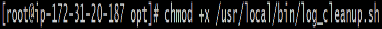
---

### **Service restart script**

```bash
vi /usr/local/bin/restart_service.sh
```
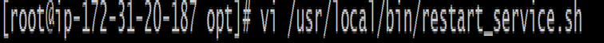
```bash
#!/bin/bash
systemctl restart nginx
```
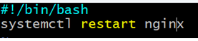
---

### **Health check script**

```bash
vi /usr/local/bin/health_check.sh
```
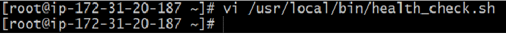
```bash
#!/bin/bash
echo "CPU:"
top -bn1 | grep "Cpu(s)"
echo "Memory:"
free -h
echo "Disk:"
df -h
```
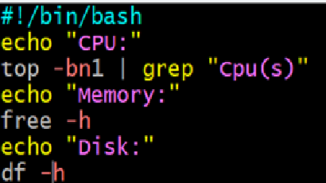
---

## ✔ **Log Management**

### **Commands**

```bash
cd /var/log

# View logs
tail -f syslog     # Ubuntu
tail -f messages   # RHEL

# Search logs
grep -i "error" /var/log/syslog
```
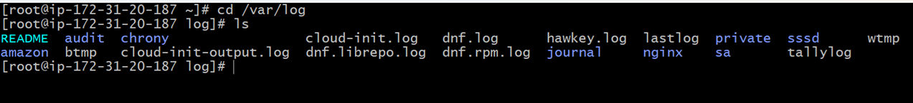
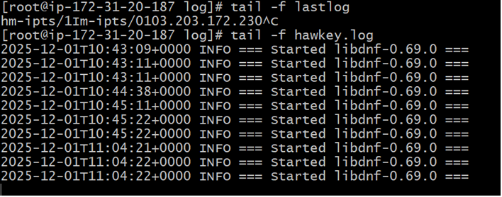
---

## ✔ **System Performance Monitoring**

### **Commands**

```bash
top
htop
vmstat 5
iostat
journalctl -u nginx
systemctl status nginx
```
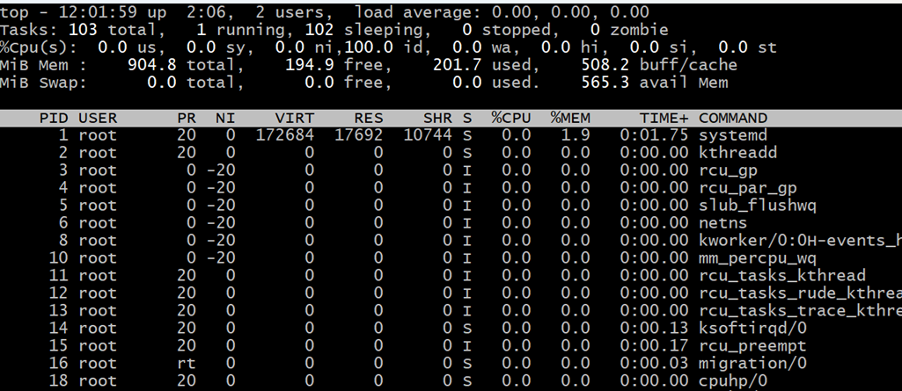
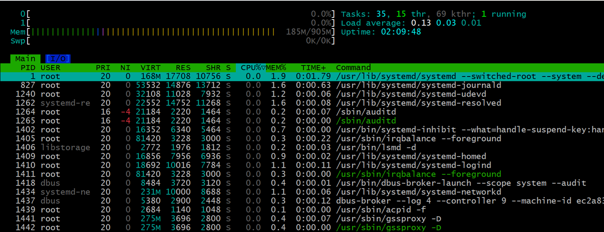
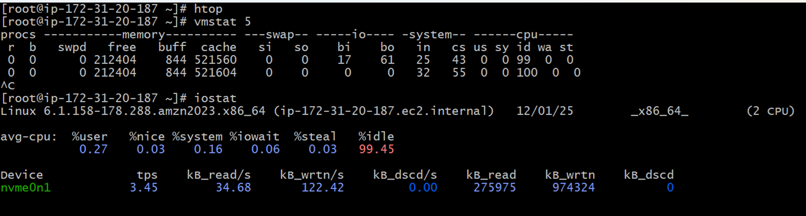
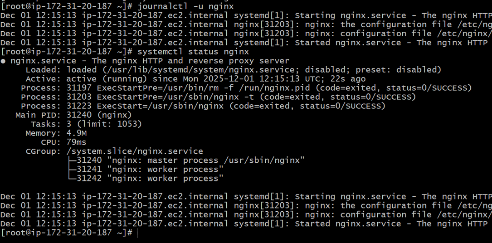
---

# 📕 **Level 3 – Advanced (Production-Ready Linux Admin)**

---

## ✔ **Custom systemd Service Creation**

### **Commands**

```bash
sudo nano /etc/systemd/system/myapp.service
```

```ini
[Unit]
Description=My Application Service
After=network.target

[Service]
ExecStart=/usr/bin/java -jar /opt/myapp/app.jar
Restart=always
User=devuser1

[Install]
WantedBy=multi-user.target
```

```bash
sudo systemctl daemon-reload
sudo systemctl enable --now myapp
```
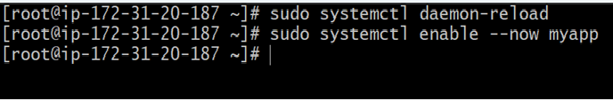
---

## ✔ **SSH Hardening**

### **Commands**

```bash
sudo nano /etc/ssh/sshd_config
```

Change:

```
PermitRootLogin no
PasswordAuthentication no
Port 2222
```
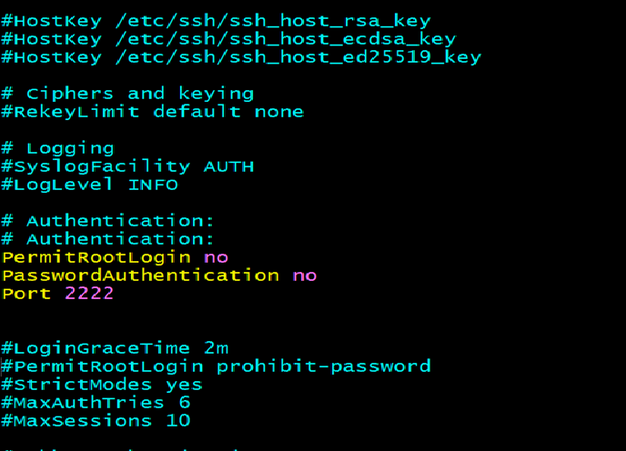
Apply changes:

```bash
sudo systemctl restart sshd
```
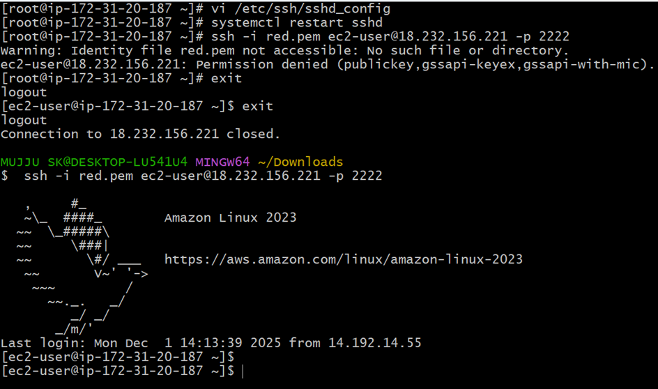
---

## ✔ **LVM Setup**

### **Commands**

```bash
# List disks
lsblk

# Create Physical Volume
sudo pvcreate /dev/xvdf

# Create Volume Group
sudo vgcreate appvg /dev/xvdf

# Create Logical Volume
sudo lvcreate -l 100%FREE -n applv appvg

# Format the LV
sudo mkfs.ext4 /dev/appvg/applv

# Mount LV
sudo mkdir /mnt/appdata
sudo mount /dev/appvg/applv /mnt/appdata
```

---

## ✔ **Firewall Configuration**

### **Using firewalld**

```bash
sudo firewall-cmd --add-service=http --permanent
sudo firewall-cmd --add-service=https --permanent
sudo firewall-cmd --reload
```
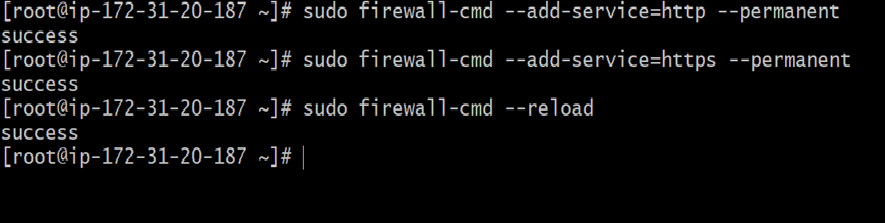
### **Using iptables**

```bash
sudo iptables -A INPUT -p tcp --dport 80 -j ACCEPT
sudo iptables -A INPUT -p tcp --dport 443 -j ACCEPT
sudo service iptables save
```
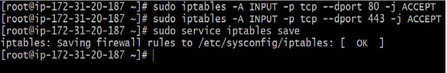
---

## ✔ **Log Rotation**

### **Commands**

```bash
sudo nano /etc/logrotate.d/myapp
```
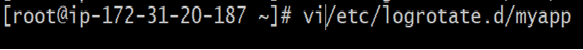
```
/var/log/myapp/*.log {
    daily
    rotate 10
    missingok
    compress
    notifempty
    create 0640 root root
}
```
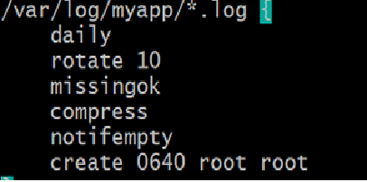
Test configuration:

```bash
sudo logrotate -d /etc/logrotate.d/myapp
```
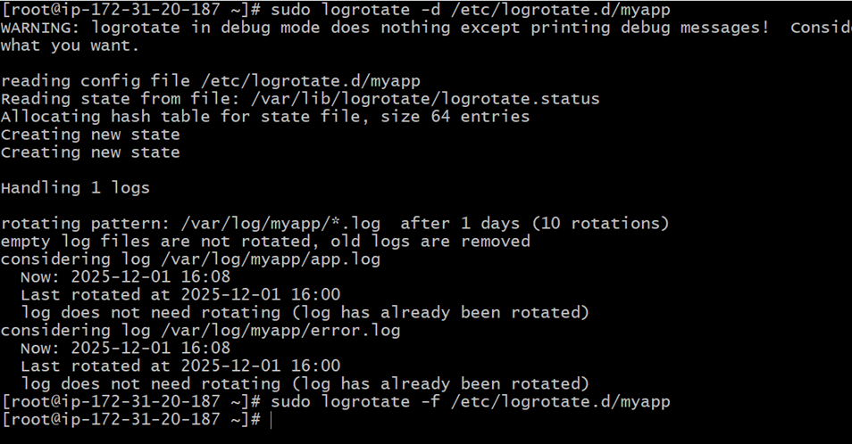
---


# 🏁 **Outcome of the Project**

This project demonstrates real-world Linux administration:
✔ System setup
✔ Automation
✔ Backups
✔ Monitoring
✔ LVM scalability
✔ Security hardening
✔ Custom services
✔ Production-ready server configuration

---


